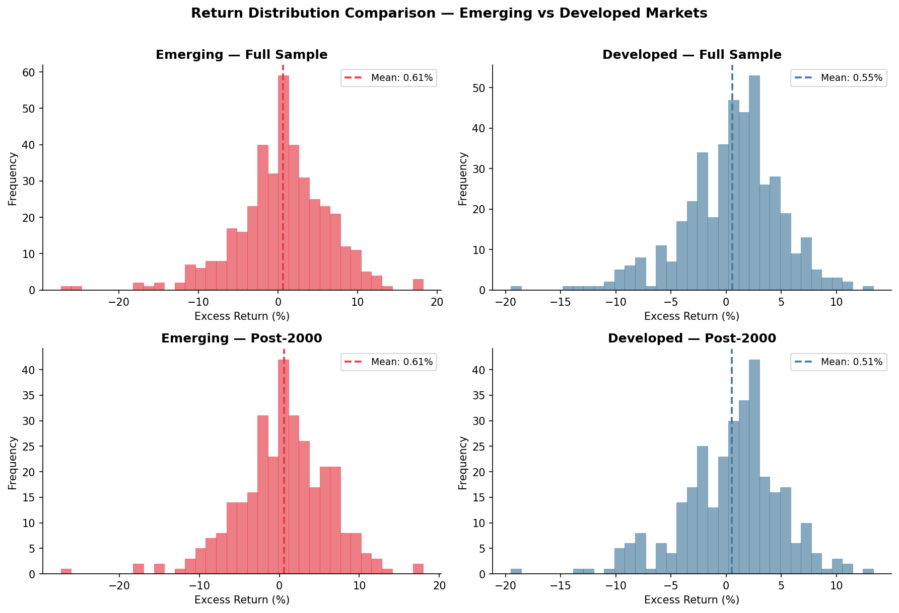
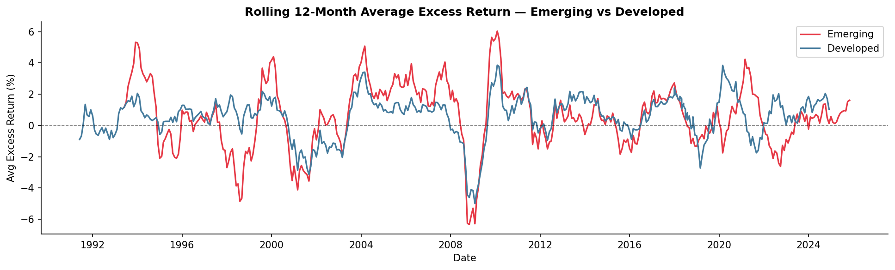
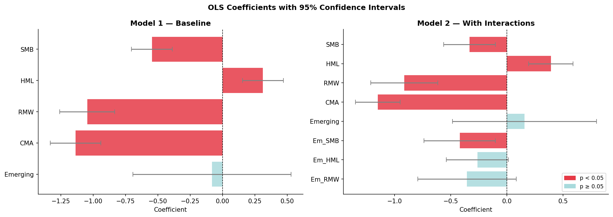

# Fama-French Factor Analysis — Emerging vs Developed Markets

> **Econometric analysis of return differences between emerging and developed  
> market portfolios using the Fama-French five-factor model (1989–2025).**

[](https://www.python.org/)
[](https://pandas.pydata.org/)
[](https://numpy.org/)
[](https://scipy.org/)
[](https://jupyter.org/)
[](https://mba.tuck.dartmouth.edu/pages/faculty/ken.french/data_library.html)
[](LICENSE)
[](https://egade.tec.mx/)

---

## Research Question

> **Do emerging market portfolios earn a systematic risk premium over developed  
> markets after controlling for Fama-French factors?**

---

## Overview

This project applies the **Fama-French five-factor model** to compare return behavior between emerging and developed market portfolios over 36 years of monthly data (1989–2025). Two OLS models are estimated and compared: a baseline model with a market-type dummy, and an extended model with factor interaction terms to capture structural heterogeneity.

The full analysis is available as a **Jupyter Notebook** (`fama_french_analysis.ipynb`) with embedded outputs and visualisations, and as a production-ready **Python script** (`src/fama_french_analysis.py`).

Key findings:
- Emerging markets show **35% higher volatility** than developed markets (σ = 5.88% vs 4.35% monthly)
- **No statistically significant country-risk premium** was found after controlling for systematic factors (β_Emerging = −0.082, p = 0.794)
- The **Emerging×SMB interaction is highly significant** (β = −0.420, p = 0.010), indicating structural differences in size-factor sensitivity between market types
- **Model 2 is preferred** based on AIC (4825.60 vs 4827.27) and economic justification

---

## Data

| Parameter | Value |
|---|---|
| Source | Fama-French Data Library |
| Period | January 1989 – November 2025 |
| Frequency | Monthly |
| Observations | 826 (after cleaning) |

### Variables

| Variable | Description |
|----------|-------------|
| `Mkt-RF` | Excess market return — dependent variable |
| `SMB` | Small Minus Big — size factor |
| `HML` | High Minus Low — value factor |
| `RMW` | Robust Minus Weak — profitability factor |
| `CMA` | Conservative Minus Aggressive — investment factor |
| `Emerging` | Dummy: 1 = emerging markets, 0 = developed markets |

**Data cleaning:** Values of `−99.99` and `−99.999` represent missing observations in the Fama-French database. These are replaced with `NaN` and dropped before analysis.

---

## Models

### Model 1 — Baseline

$$\text{MktRF}_t = \beta_0 + \beta_1\text{SMB} + \beta_2\text{HML} + \beta_3\text{RMW} + \beta_4\text{CMA} + \beta_5\text{Emerging} + \varepsilon_t$$

### Model 2 — Extended (heterogeneous factor loadings)

$$\text{MktRF}_t = \beta_0 + \beta_1\text{SMB} + \beta_2\text{HML} + \beta_3\text{RMW} + \beta_4\text{CMA} + \beta_5\text{Emerging} + \beta_6(\text{Em}{\times}\text{SMB}) + \beta_7(\text{Em}{\times}\text{HML}) + \beta_8(\text{Em}{\times}\text{RMW}) + \varepsilon_t$$

Interaction terms allow factor sensitivities to **vary by market type**. The total SMB sensitivity for emerging markets is $\beta_1 + \beta_6$.

---

## Results

### Descriptive Statistics

| Portfolio | N | Mean (%) | Variance | Std Dev (%) | Skewness | Kurtosis |
|-----------|---|----------|----------|-------------|----------|----------|
| Emerging (Full) | 401 | 0.608 | 34.587 | 5.881 | −0.598 | 2.204 |
| Developed (Full) | 425 | 0.550 | 18.904 | 4.348 | −0.641 | 1.474 |
| Emerging (Post-2000) | 311 | 0.614 | 32.869 | 5.733 | −0.525 | 1.977 |
| Developed (Post-2000) | 311 | 0.514 | 20.179 | 4.492 | −0.606 | 1.348 |

### Model Comparison

| Criterion | Model 1 | Model 2 | Δ |
|-----------|---------|---------|---|
| AIC | 4827.27 | **4825.60** | −1.67 |
| BIC | **4855.57** | 4868.05 | +12.48 |
| R² | 0.2524 | 0.2621 | +0.0097 |
| R² Adjusted | 0.2479 | 0.2548 | +0.0069 |
| Parameters | 6 | 9 | +3 |

**Preferred: Model 2** — lower AIC; Emerging×SMB significant at p = 0.010.

### Key Coefficients — Model 2

| Variable | Coefficient | Std Error | t-stat | p-value | |
|----------|------------|-----------|--------|---------|--|
| SMB | −0.333 | 0.118 | −2.82 | 0.005 | *** |
| HML | +0.392 | 0.101 | +3.88 | 0.000 | *** |
| RMW | −0.914 | 0.152 | −6.00 | 0.000 | *** |
| CMA | −1.149 | 0.101 | −11.37 | 0.000 | *** |
| Emerging | +0.157 | 0.327 | +0.48 | 0.633 | |
| **Emerging×SMB** | **−0.420** | **0.162** | **−2.59** | **0.010** | *** |
| Emerging×HML | −0.263 | 0.141 | −1.87 | 0.062 | * |
| Emerging×RMW | −0.356 | 0.224 | −1.59 | 0.112 | |

*\*\*\* p<0.01 · \*\* p<0.05 · \* p<0.1*

### Hypothesis Tests

| Test | H₀ | Statistic | p-value | Decision (α=0.05) |
|------|----|-----------|---------|-------------------|
| 1 | β_Emerging = 0 | t = −0.262 | 0.794 | Fail to reject |
| 2 | β_Emerging = 0.6 | t = −2.184 | 0.029 | **Reject** |
| 3 | β_Em×SMB = 0 | t = −2.595 | 0.010 | **Reject** |
| 4 | β_Em×HML = β_Em×RMW = 0 | F = 2.366 | 0.094 | Fail to reject (α=0.05) |

---

## Visualisations

### Fig 1 — Return Distribution (Full Sample & Post-2000)


### Fig 2 — Rolling 12-Month Average Excess Return


### Fig 3 — OLS Coefficients with 95% Confidence Intervals


---

## Technical Implementation

The OLS engine is implemented from scratch using `numpy.linalg.lstsq` — no `statsmodels` dependency required. The `OLSResult` class computes:

- Coefficients, standard errors, t-statistics, p-values
- 95% confidence intervals
- R², adjusted R²
- AIC and BIC (for model selection)
- Two-sided t-tests for individual coefficients
- Joint F-tests for groups of coefficients

This makes the codebase **portable and dependency-light** — runs anywhere Python 3.9+ is installed with only `numpy`, `pandas`, `scipy`, and `matplotlib`.

---

## Repository Structure

```
fama-french-emerging-vs-developed/
│
├── fama_french_analysis.ipynb     ← full analysis notebook (start here)
├── README.md
│
├── src/
│   └── fama_french_analysis.py    ← production script
│
├── data/
│   └── .gitkeep                   ← place FamaRichvPoor.xlsx here
│
└── outputs/
    ├── fig1_histograms.png
    ├── fig2_time_series.png
    └── fig3_coefficients.png
```

---

## How to Run

```bash
# 1. Clone the repo
git clone https://github.com/K-M33/fama-french-emerging-vs-developed.git
cd fama-french-emerging-vs-developed

# 2. Install dependencies
pip install pandas numpy scipy matplotlib seaborn openpyxl

# 3. Place the data file in /data
#    FamaRichvPoor.xlsx  (Fama-French Data Library)

# 4a. Run the notebook
jupyter notebook fama_french_analysis.ipynb

# 4b. Or run the script directly
python src/fama_french_analysis.py
```

---

## Academic Context

Developed for the **Econometría Financiera** course at  
**EGADE Business School, Tecnológico de Monterrey** (2025–2026).

The analysis follows the methodology of Fama & French (1993, 2015) applied to international portfolio data, examining whether the emerging market label carries a risk premium beyond what is explained by systematic factors.

---

## References

- Fama, E. F., & French, K. R. (1993). Common risk factors in the returns on stocks and bonds. *Journal of Financial Economics*, 33(1), 3–56.
- Fama, E. F., & French, K. R. (2015). A five-factor asset pricing model. *Journal of Financial Economics*, 116(1), 1–22.
- Harvey, C. R. (1995). Predictable risk and returns in emerging markets. *Review of Financial Studies*, 8(3), 773–816.
- Bekaert, G., & Harvey, C. R. (2002). Research in emerging markets finance. *Emerging Markets Review*, 3(4), 429–448.
- Estrada, J. (2002). Systematic risk in emerging markets: The D-CAPM. *Emerging Markets Review*, 3(4), 365–379.

---

## Author

**Diana Krystell Magallanes Pichardo**  
Master's in Finance — EGADE Business School  
[LinkedIn](https://linkedin.com/in/krystell-magallanes) · krystellmag.94@gmail.com

---

## License

MIT License — free to use for educational and non-commercial purposes.

